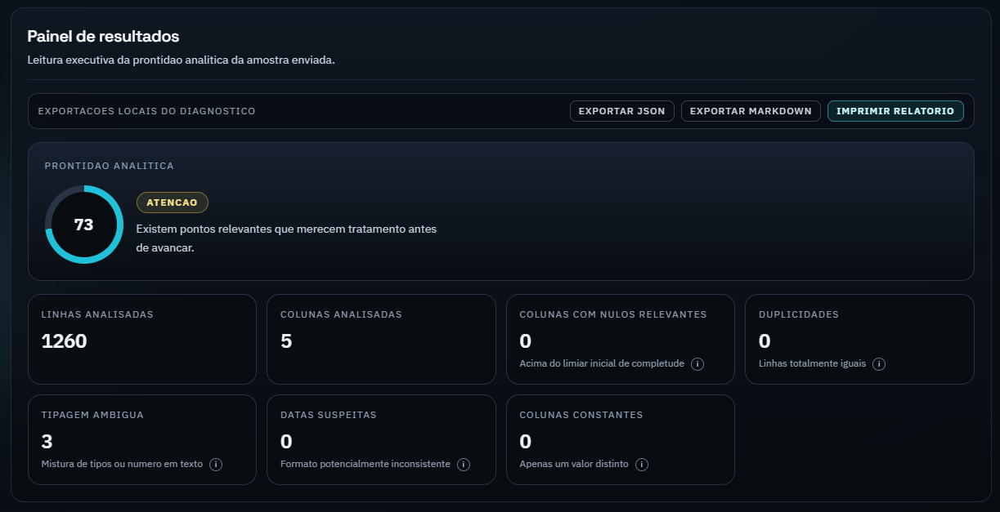

# Base Clara | Antes do Dashboard

O **Base Clara** e uma ferramenta gratuita para diagnosticar rapidamente a qualidade de arquivos de dados antes da etapa de analise e dashboard.

Sem backend, sem envio de dados para servidor: tudo acontece no seu navegador.

## Acesse agora

**Produto online:** [https://baseclara.netlify.app](https://baseclara.netlify.app)

Clique na imagem para abrir o app:

## O que voce consegue fazer

- Carregar arquivos `.csv`, `.xlsx` e `.xls` direto no navegador.
- Receber um diagnostico de qualidade com score e prioridades de tratamento.
- Visualizar riscos de analise antes de construir dashboard.
- Gerar exemplos praticos de tratamento em:
  - Python (pandas)
  - Power Query (M)
  - SQL
- Exportar diagnostico para compartilhamento tecnico.

## Diferenciais do produto

- **100% client-side:** seus dados nao saem da sua maquina.
- **Uso imediato:** nao exige instalacao local.
- **Foco pratico:** transforma problemas de dados em plano acionavel.
- **Leitura rapida:** interface pensada para decisao, nao para complexidade.

## Para quem e

- Analistas de dados e BI.
- Profissionais que recebem planilhas operacionais.
- Times que querem reduzir retrabalho antes do dashboard.
- Pessoas que precisam validar qualidade de dados em poucos minutos.

## Como usar (30 segundos)

1. Acesse [baseclara.netlify.app](https://baseclara.netlify.app).
2. Envie seu arquivo.
3. Veja o diagnostico, as prioridades e os exemplos de tratamento.

## Privacidade em primeiro lugar

O Base Clara foi desenhado para manter o processamento local no navegador.  
Seu arquivo e tratado no proprio dispositivo durante o uso do app.
